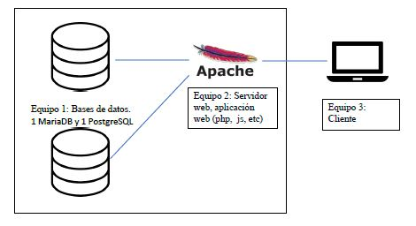

# Prueba Segundo Bimestre Servicios Sobre Redes

# Integrantes:
     * Aarón Cruz
     * Anthony Tacuri

## Arquitectura de una aplicación con contenedores Docker

## MariaDB

1. Primero abrimos la aplicación Kitematic e instalamos las bases de datos (MariaDB y PostgreSQL)

## PostgreSQL

2. Luego abrimos una terminal para configurar nuestras bases de datos y conectarnos a las bases de datos.

     * docker run -d --rm --name pruebadb -e MYSQL_ROOT_PASSWORD=root -p 3306:3306 mariadb
     * docker run -d --rm --name pruebasr -e POSTGRES_PASSWORD=root -p 5432:5432 postgres

3. Verificamos que hayamos creado nuestros contenedores con el siguiente comando 

     * docker ps

4. Conectamos nuestras bases de datos con DBeaver una aplicación para administrar bases de datos

## MariaDB

## PostgreSQL

5. Creamos una base de datos en cada conexion llamada "serviciosdb" con una tabla llamada "estudiantes"

## MariaDB

## PostgreSQL

6. Ingresamos un dato para luego consumirlo desde la aplicación web

## MariaDB

## PostgreSQL

## Creación del servidor apache php

7. Creamos una carpeta para levantar nuestro servidor apache, en este caso es la carpeta llamaca apache

8. Dentro de esa carpeta creamos una carpeta para añadir neustros archivos php en este caso son dos mariadb.php y postgre.php

9. Posteriormente movemos nuestros archivos a la carpeta creada anteriormente "sites"

10. Abrimos la carpeta apache en el editor de código de visual studio.

11. Creamos un nuevo archivo Dockerfile para crear una nueva imagen

12. Abrimos la terminal de windows y ejecutamos el siguiente comando docker pull php:7.4-apache

13. Dentro del archivo Dockerfile escribimos las siguientes lineas de código

14. Posteriormente ejecutamos el siguiente comando en la carpeta de apache "docker build -t pruebab2 ." para construir la imagen

15. Finalmente ejecutamos el siguiente comando para la configuración final "docker run -i --rm  --name pruebab2 -p 80:80 pruebab2"

16. Ahora ya podemos levantar el siguiente comando para levantar nuestro servidor "docker run -i --rm --name pruebab2 -p 80:80 pruebab2"

17. Verificamos los resultados en el navegador de los archivos php mariadb.php y postgre.php

## MariaDB

## Postrgree

## Hamachi

18. Para la conexión de la base de datos de mariadb y postgree en otro equipo usamos la aplicación de hamachi para crear una vpn y tener conexion entre la máquina cliente, servidor apache y SGBD.

